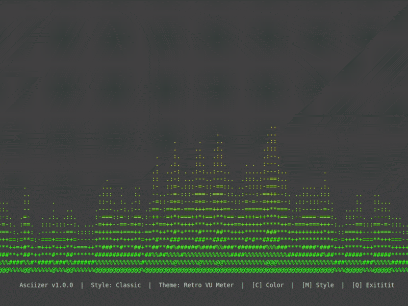

<div align="center">
<pre>
   ###     ######   ######  #### #### ######## ######## ########  
  ## ##   ##    ## ##    ##  ##   ##       ##  ##       ##     ## 
 ##   ##  ##       ##        ##   ##      ##   ##       ##     ## 
##     ##  ######  ##        ##   ##     ##    ######   ########  
#########       ## ##        ##   ##    ##     ##       ##   ##   
##     ## ##    ## ##    ##  ##   ##   ##      ##       ##    ##  
##     ##  ######   ######  #### #### ######## ######## ##     ##
</pre>
</div>

> Real-time audio visualizer in your terminal powered by ASCII art.

<p align="center">
  
</p>

## Features

- Real-time dynamic audio spectrum analysis (FFT).

- Custom ASCII visual rendering tailored for terminals, featuring 6 color themes (_Classic Green, Cyberpunk Pink, Electric Blue [like the song], Sunset Orange, Monochrome Minimal, Retro VU Meter_).

- Open, run, and enjoy a fun visual experience while listening to your favorite tracks.

## What does it do?

- **Feel the music**: Watch the screen come to life and react to the rhythm of your songs.

- **Retro style for your console**: Turn your terminal into a display full of art and motion.

## Installation

1. **Install the program:**
   ```bash
   npm install -g ascii-viz
   ```
2. **Launch it whenever you want by typing**:
   ```bash
   asciizer
   ```
## Uninstall

If at any point you wish to remove the program from your computer, open the terminal and run:

```bash
npm uninstall -g ascii-viz
```
